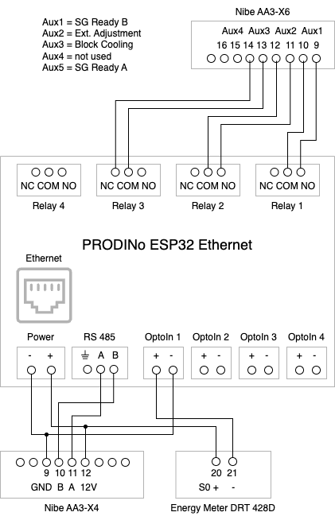

# nibe-mqtt-gateway

nibe-mqtt-gateway is an MQTT integration for Nibe heatpumps.

It is used to integrate a Nibe VVM310/S2125 into Home Assistant via Mosquitto as MQTT broker.
Additionally, nibe-mqtt-gateway publishes heapump monitoring data as Prometheus metrics, provides 4 relays that can be used to control the Nibe AUX inputs and it can count the electrical energy consumption via an S0 interface.

## Features

- [x] connection to Nibe heatpump VVM310/S2125 via RS485
- [x] wired Ethernet (no Wifi needed nor supported)
- [x] direct connection to MQTT broker
- [x] configurable set of of published Nibe registers
- [x] supports Modbus Data Messages (fast reading of up to 20 registeres preconfigured by Modbus Manager, no 32 bit registers)
- [x] supports writing to Nibe registers
- [x] energy meter connected via S0 interface to OptIn1, persisted in NVS
- [x] exposes the 4 relays of the PRODIno ESP32 board via MQTT
- [x] supports Home Assistant MQTT auto-discovery
- [x] simple web UI for info and administration
- [x] OTA updates (well, over Ethernet)
- [x] upload of configuration files including the ModbusManager CSV file
- [x] metrics via Prometheus endpoint
- [x] nibe registers and other measurements as Prometheus metrics
- [x] logging via MQTT topic (as alternative to serial interface)
- [x] automatic safe-boot mode when ending up in crash loop

## Prerequisites

- [PRODINo ESP32 Ethernet v1 board](https://kmpelectronics.eu/products/prodino-esp32-ethernet-v1/) - other boards might be possible but have not been tested
- USB adapter for debugging (via serial output, no real JTAG debugging unfortunately) and initial uploading of firmware
- Nibe heatpump VVM310/S2125 - other models might work but have not been tested
- ESP-IDF v5.1.4
- MQTT broker like [Mosquitto](https://mosquitto.org/)
- energy meter with [S0 interface](https://de.wikipedia.org/wiki/S0-Schnittstelle), e.g. DRT 428D
- a safe, well-protected home network. nibe-mqtt-gateway is lacking even the most basic security measures. Never expose nibe-mqtt-gateway to the internet.

Additionally helpful:
- Visual Studio Code + [ESP-IDF Visual Studio Code Extension](https://github.com/espressif/vscode-esp-idf-extension)

## Installation

### Wiring



### Build Firmware

- install ESP-IDF v5.1.4
- clone this project
- adapt settings, especially `idf.espIdfPath` to point to ESP-IDF installation
- generate sdkconfig and adapt if necessary
- build project, see also Development section below

Result is a firmware file: `./build/nige-mqtt-gateway.bin`

### Installation

For initial installation, flash the firmware using a serial adapter.

For subsequent installations, the firmware can be uploaded via OTA: http://nibegw/update

### Configuration

The configuration consists of:
- general configuration json `config.json` like MQTT broker url and credentials, heatpump registers to be polled, logging etc.
- a Nibe ModbusManager file that defines all available registers, `nibe-modbus.csv`
- the Energy Meter value can be set to adjust it with the real meter reading

When uploading a configuration file, nibe-mqtt-gateway stores it in flash memory and reboots to activate the configuration change.

General configuration:
- see [config/config.json.template](config/config.json.template) for format and configuration options, json file allows comments
- http://nibegw/config shows the current configuration as uploaded
- http://nibegw/config?runtime=true shows the current runtime configuration (internal data structures translated back to json, for debugging)
- upload `config.json`: `curl -X POST -H "Content-Type: application/json" --data-binary @config.json http://nibegw/config`

Nibe Modbus configuration:
- http://nibegw/config/nibe shows the current nibe modbus configuration. A csv file in Nibe ModbusManager format.
- use Nibe ModbusManager to get a CSV with all registers. Save e.g. as [config/nibe-modbus-vvm310.csv](config/nibe-modbus-vvm310.csv).
- upload `nibe-modbus-vvm310.csv`: `curl -F "upload=@nibe-modbus-vvm310.csv" http://nibegw/config/nibe`

Energy Meter configuration (also via UI):
- adjusting energy meter
  - `curl -X POST -H "Content-Type: application/json" -d <energy in Wh> http://nibegw/config/energymeter`
  - to prevent misconfiguration: value can only be changed by +-10kWh
  - increases are set immediately
  - decreases are waited, i.e. energy counter stops counting for the diff to avoid breaking counter metrics
- set energy counter to an initial value without any checks - can break counter metrics
  - `curl -X POST -H "Content-Type: application/json" -d <energy in wh> http://nibegw/config/energymeter?init=true`
- no reboot when adjusting the energy meter

### Trouble Shooting

The RGB multi-functional LED shows the status of nibe-mqtt-gateway:
- blue - initializing
- blue blinking - waiting for IP address
- green blinking - running ok, connected with MQTT broker
- red blinking - error, got IP address but e.g. not connected with MQTT broker, check http://nibegw or logs
- orange blinking - OTA firmware upload in progress

Web UI:
- http://nibegw - main page with some status info and several config options
- http://nibegw/update - OTA update and upload of file system
- http://nibegw/metrics - Prometheus endpoint with some insights like heap, uptime and execution times (in addition to heatpump metrics)

Depending on the configuration, logs are available via Serial interface or the MQTT topic `nibegw/log`.
Show logging over MQTT:
```
mosquitto_sub --url 'mqtt://<user>:<password>@<broker>/nibegw/log'
```

Log levels can be configured via `config.json` (see above):
- standard ESP logging config applies, especially `CONFIG_LOG_MAXIMUM_LEVEL`
- default log level is `info`, unless changed in `sdkconfig`
- nibe-mqtt-gateway sources are complied with `LOG_LOCAL_LEVEL=ESP_LOG_DEBUG` to allow debug logging
- log levels can be temporarily changed via UI or curl
  - `curl -X POST -H "Content-Type: application/x-www-form-urlencoded" -d "tag=<tag>&level=<none|error|war|info|debug|verbose>"  http://nibegw/config/log`
  - log levels are set back to `config.json` settings after reset

After 3 fast crashes in a row, nibe-mqtt-gateway boots into a safe-mode that should allow to upload a fixed/working firmware via OTA:
- only OTA upload is supported
- no mqtt, nibegw, energy meter, etc. 
- Nibe RS485 protocol is maintained so that the heat pump should not go into alarm state (received data is acknowledged but ignored)
- init status is shown as 0x0001 (= InitStatus::SafeBoot)
- metrics other than `nibegw_status_info` are missing   
- logs are only available via serial interface

## Development

### Build

Visual Studio Code + [ESP-IDF Visual Studio Code Extension](https://github.com/espressif/vscode-esp-idf-extension) is used as IDE.

- switch target to `esp32`
- delete `sdkconfig` file
- 'Full Clean' (delete `build` directory)
- 'Build' project
- Upload to Prodino board either via serial interface or OTA
- see above for configuration and trouble shooting

### Unit Testing

Parts of the code base have unit tests using [Unity](https://www.throwtheswitch.org/unity) that can run on the Linux/Mac (see [ESP-IDF - Running Applications on Host](https://docs.espressif.com/projects/esp-idf/en/release-v5.1/esp32/api-guides/host-apps.html)).

How to run unit tests using vscode:
- switch target to `linux`
- delete `sdkconfig` file
- 'Full Clean' (delete `build` directory)
- 'Build' project, ignore the error by `esp_idf_size`
- 'Monitor' runs the unit tests and prints results to console
  - attention: 'Monitor' doesn't build -> an explicit 'Build' is needed after any source code change

Implementation:
- tests are located in a special `test` component, this component picks source files from `main` that can be tested 
- any code that depends on `arduino-esp32` can't run on the host emulation and therefore is not testable easily, this includes any usage of the Arduino String class

## To Do

- [ ] smoother unit testing development cycle: vscode task, less Arduino dependencies
- [ ] debugging, at least for unit tests on host
- [ ] authentication for admin operations (OTA, config uploads etc.)
- [ ] replace arduino-esp32 by native esp-idf (less dependencies, should save up to 90k)
 
## Credits

Used source code and libraries
- [arduino-esp32](https://github.com/espressif/arduino-esp32) - Arduino core for the ESP32, [LGPL v2.1](https://github.com/espressif/arduino-esp32/blob/master/LICENSE.md)
- [ArduinoJson](https://arduinojson.org/) - JSON Library, [MIT License](https://github.com/bblanchon/ArduinoJson/blob/7.x/LICENSE.txt)
- [esp-idf](https://github.com/espressif/esp-idf) - Espressif IoT Development Framework, [Apache License 2.0](https://github.com/espressif/esp-idf/blob/master/LICENSE)
- [esp-idf-net-logging](https://github.com/nopnop2002/esp-idf-net-logging) - Redirect esp-idf logging to the network, [MIT License](https://github.com/nopnop2002/esp-idf-net-logging/blob/main/LICENSE)
- [org.openhab.binding.nibeheatpump](https://github.com/openhab/openhab-addons/tree/main/bundles/org.openhab.binding.nibeheatpump) - nibegw, [Eclipse Public License 2.0](https://github.com/openhab/openhab-addons/blob/main/bundles/org.openhab.binding.nibeheatpump/NOTICE)
- [ProDinoESP32](https://github.com/kmpelectronics/ProDinoESP32) - KMP ProDino ESP32 examples library
- [Unity](https://www.throwtheswitch.org/unity) - Unit testing for C, [MIT License](https://github.com/ThrowTheSwitch/Unity/blob/master/LICENSE.txt)

Inspiration and ideas
- [nibe-mqtt](https://github.com/yozik04/nibe-mqtt) - Nibe MQTT integration, [GPL 3.0](https://github.com/yozik04/nibe-mqtt/blob/master/LICENSE)

## License and Disclaimer

This project has been developed for personal use only. The code is provided AS IS under the [Apache License v2.0](./LICENSE) in the hope that it will be useful, but WITHOUT ANY WARRANTY whatsoever.

Nibe is registered mark of NIBE Energy Systems.